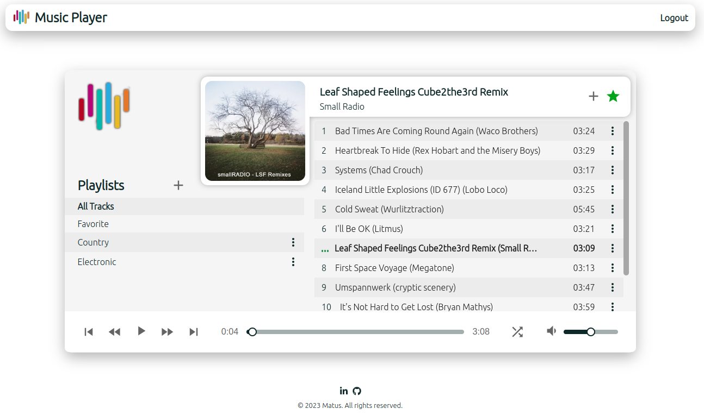
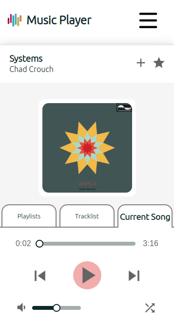

# Music player - Web application

## Status - NOT FINISHED -> In Progress
The Music Player app is currently in active development, and work is ongoing to bring its features to life. While the application is not yet finalized, I'm dedicated to refining and enhancing its functionality. Stay tuned for updates and improvements as we work towards delivering an exceptional music experience.

## Description

MusicPlay is a dynamic web application designed for music enthusiasts, enabling them to seamlessly play, create, and manage playlists. With its intuitive user interface and backend infrastructure, MusicPlay transforms music consumption into a personalized and enjoyable experience.

## Demo
You can test demo version [here](https://music-player-zeta-fawn.vercel.app/) 

### Features
1. Music Playback: Playing songs with basic controls - switching between songs, playing, pausing, skipping forward/backward, controlling volume etc.

2. Playlist Creation: Craft your own musical journeys by creating custom playlists. Curate a collection of songs that match your mood, genre preference, or any other criteria you desire.

3. Playlist Editing: Modify your playlists on the fly. Add or remove songs, rearrange tracks, and fine-tune the order to achieve the perfect playlist flow.

4. Google Drive Integration: MusicPlay seamlessly integrates with your Google Drive account. Store your music files on Google Drive, and the application can access and play them directly, ensuring a hassle-free listening experience.

5. Real-time Data Refresh: MusicPlay keeps your song information up-to-date by periodically refreshing data from the Google Drive API. This ensures that your music library remains accurate and relevant.

6. Backend Infrastructure: The backend of MusicPlay is powered by an API server. It interacts with a MySQL database to store and manage essential song information, including metadata and play history.

7. User-friendly Interface: The frontend interface is designed for both simplicity and functionality. Intuitive navigation, easy-to-use controls, and visually appealing design make MusicPlay a joy to use.

8. Responsive design

## Technology Stack:
The project is divided into two codebases. The Frontend and the Backend. The main language is TypeScript for both parts.

### Frontend
The frontend is developed using modern web technologies, including HTML, CSS, and JavaScript. Frameworks like React may be used to create a responsive and interactive user interface. The MUI is implemented as well. For asynchronous state management is used TanStack Query.

### Backend
The Music Player app's backend employs Express, a Node.js framework, for request handling. The server integrates with a MySQL database to store data, while the Google Drive API enables access and retrieval of music files stored in users' Google Drive accounts.

### Preview - current WIP version
The printscreen of the current version, which is not finished.

  <h2>Desktop version</h2>

  <h2>Mobile version</h2>

